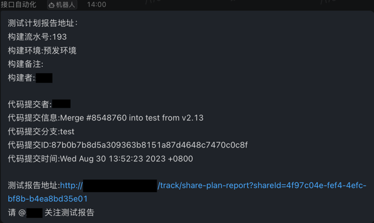

### 云效流水线打包成功后调用Metersphere平台
 > 衔接阿里云云效中的流水线和Metersphere平台，流水线打包成功后通过webhook方式调用此服务，通过api方式调用Metersphere平台的实现自动化测试，并且将测试报告的连接发送到钉钉群。
 

**配置信息说明**
> 服务需要2份配置文件分别为
1. 服务初始化文件`init.json`
    ```json
      {
        "serverPort": "8008",
        "dingDingAccessToken": "钉钉AccessToken",
        "meterSphereServer": "http://127.0.0.1:8081"
       }
    ```
2. 服务配置文件`server_list.json`（云效中的代码仓库中的项目名称）
      > delayedCall：延迟执行测试计划的时间单位秒
    ```json
      [
       {
           "serverName": "仓库地址中的名称",
           "projectId": "Metersphere中的例如：a9cdbc0b-a5fd-497e-9f64-5891a55fdfc1",
           "testPlanId": "Metersphere中的例如：5851e4b7-5e34-4f82-8d81-bd4f1b24f982",
           "delayedCall": 2 
       }
       ]
    ```
**钉钉通知内容如下：**


